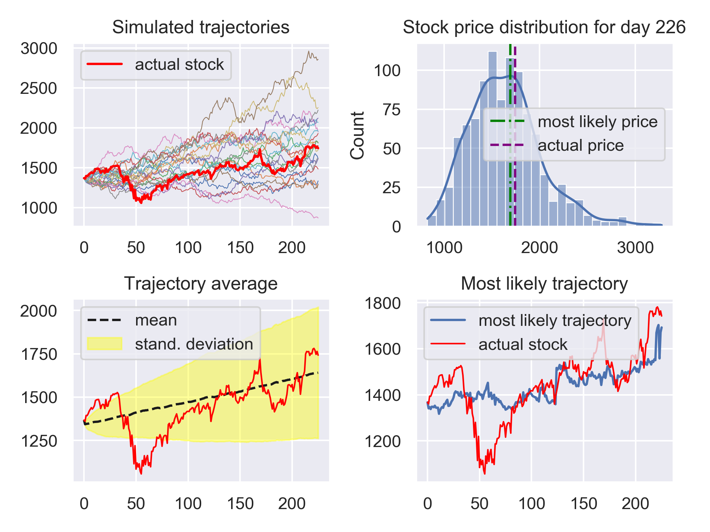

# Predicting stock prices with Monte Carlo methods

In this project we explore the mathematical / stochastical model of geometric Brownian motion in order to simulate stochastically accurate trajectories of a given stock's price and thereafter approximating the underlying statistics using Monte Carlo methods to ultimately predict the stock price on a given day.

## Mathematical preliminaries

Firstly, remember the geometric Brownian motion is a stochastic process defined by the *stochastic* differential equation 

## How it's implemented

First of all we need to determine the drift $\mu$ and the volatility $\sigma$ of our model.
To do this we use `pandas_datareader` to download a `DataFrame` of the stock in question over a period of time at our discretion. After having extracted the above parameters we can start the Monte Carlo simulations.
Since these are computationally expensive for a large number of simulations and/or a large time to simulate ahead - in other words this is the performance critical part of our program - this part of the code has been implemented with support for multithreading in C rather than Python. (See `c_assets/library.c`)
We wrap this code in Python and call the wrapper function `c_geometricBrownianMT` from Python with the parameters from our estimation from the `DataFrame` downloaded with `pandas_datareader`.

A particular realisation of an ensemble of trajectories for the Google stock ("GOOG") can be seen below.

After having simulated such an ensemble we can start to reconstruct the underlying probability distribution numerically using the Monte Carlo method. For this we take our (large) ensemble over a period of time $\delta t= t_{\mathrm{now}}-t_0$ and plot a histogram over the stock prices of each trajectory on the day of our interest. 
Using a kernel density estimation we can then estimate the associated probability density function (PDF) to the numerically obtained probability mass function (PMF). From this we can obtain an estimate for the most-likely stock price for that day by selecting the stock price that maximises the PDF (i.e. the maximum a posteriori solution).

There are two more things that are potentially interesting to us.
1. The mean stock price over time and the associated variance
2. The most likely trajectory based on our simulations

For the first we simply evaluate the mean over all trajectories using `pandas` to get the mean stock value and similarily we can compute the standard deviation / variance from our `DataFrame`.

For the latter we build a histogram for each time step over all trajectories and from the KDE we can find the MAP solution for each time step.

One particular realisation of the above discussed analysis can be seen below.

This particular realisation had an absolute error of 49.75$ and a relative error of 2.86% versus the actual stock price.  